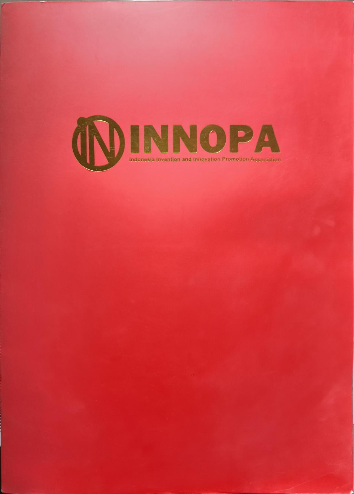
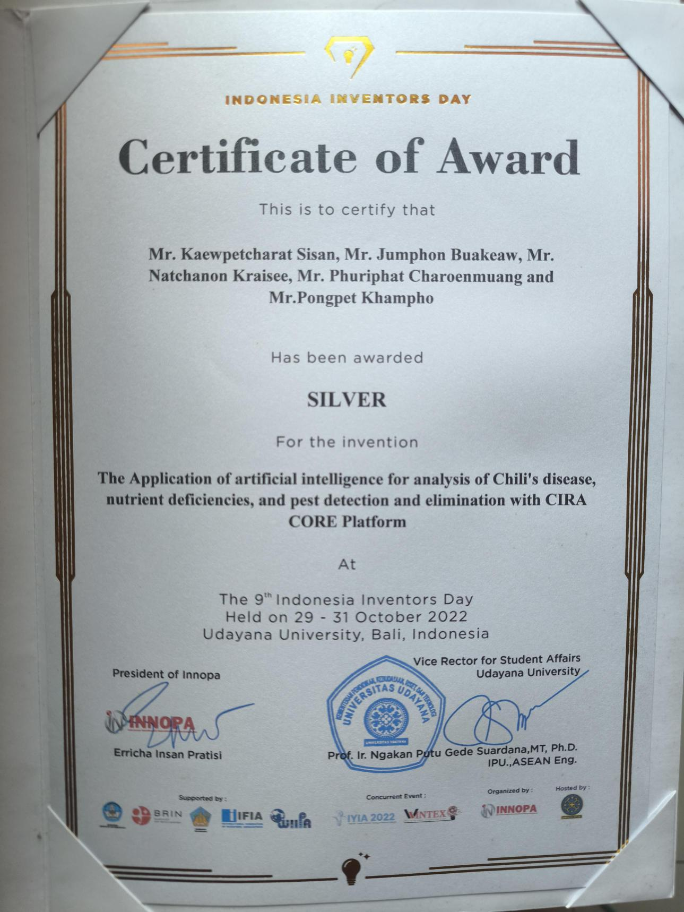

# 🏆 Achievement & Certification Portfolio
Welcome to my collection of awards and certificates, demonstrating my journey in **Data Engineering**, **AI**, and **Academic Excellence**.

---

## 🥇 International Awards
### Silver Medal - Indonesia Inventors Day 2022 (INNOPA)
**Project:** AI Application for Chili Disease & Pest Detection using CIRA CORE Platform.
**Location:** Bali, Indonesia
> Awarded for developing an AI solution to assist farmers in early disease detection using Deep Learning.

  
  

---

## 🎓 Academic Achievements
### Academic Excellence Awards (รางวัลเรียนดี)
Recognition for outstanding academic performance (Top tier of the class).
* 📄 **2024:** [Academic Excellence Award 2024 (PDF)](เกียรติบัตรรางวัลการเรียนดี_2567.pdf)
* 📄 **2023:** [Academic Excellence Award 2023 (PDF)](เกียรติบัตรรางวัลการเรียนดี_2566.pdf)

---

## ☁️ Tech Certifications
### AWS - AWSome Day Online Conference
* 📄 **Certificate:** [AWS Cloud Foundation (PDF)](AWSomeDay.pdf)
> Fundamental understanding of AWS Cloud concepts, core services, and security.
